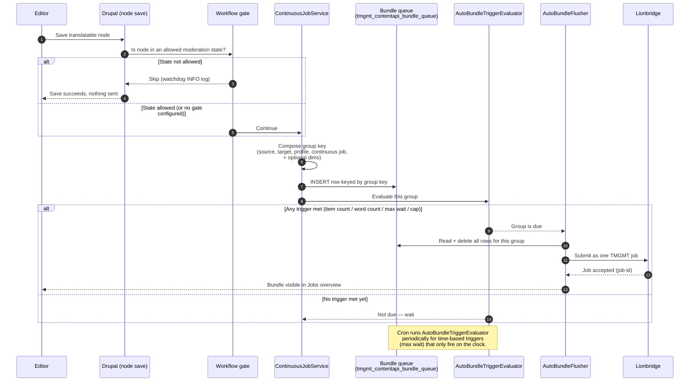

# End-to-end flow

This page traces a single translatable node from the moment an editor
clicks **Save** to the moment Lionbridge receives the file. It is the map
support staff use when a client says "it just didn't work" — every arrow
below has a page you can point them at.

## Actors

- **Editor** — a Drupal user with permission to edit a translatable node.
- **Drupal** — Node save hooks, workflow gate, continuous job service.
- **Bundle queue** — table `tmgmt_contentapi_bundle_queue`. Rows are keyed
  by the runtime-composed **group key**.
- **Trigger evaluator** — `AutoBundleTriggerEvaluator` service; decides
  whether a group is "due".
- **Bundle flusher** — `AutoBundleFlusher` service; assembles a TMGMT job
  from a group and drops the rows.
- **Lionbridge Content API** — external SaaS, receives the submission.

## Sequence

## Step-by-step, with links

| # | Step | Docs page | Config keys / routes |
|---|---|---|---|
| 1 | Editor saves a translatable node | [Enable continuous mode](/03-continuous-job/enable-continuous-mode) | — |
| 2 | Workflow gate checks moderation state | [Workflow gate](/04-auto-bundle-tab/07-workflow-gate) | `continuous_settings.workflow_states_required` |
| 3 | `ContinuousJobService` composes the group key | [Group-key composition](/05-runtime-behavior/group-key-composition) | Always-on dims + optional dims |
| 4 | Row inserted into `tmgmt_contentapi_bundle_queue` | [Queue and cron](/03-continuous-job/queue-and-cron) | Table schema |
| 5 | `AutoBundleTriggerEvaluator` decides if the group is "due" | [When bundles are released](/05-runtime-behavior/when-bundles-are-released) | `auto_bundle.trigger_*`, `auto_bundle.cap_*` |
| 6 | If due, `AutoBundleFlusher` builds one TMGMT job from all rows | [Status widget](/05-runtime-behavior/status-widget) | Route `/auto-bundle/status` |
| 7 | Lionbridge Content API accepts the job | [Install & credentials](/02-prerequisites/install-and-credentials) | Translator settings |
| 8 | Bundle appears in **Translation → Jobs** with continuous submissions link | [Continuous submissions](/03-continuous-job/queue-and-cron) | Route `/admin/tmgmt/jobs/{tmgmt_job}/submissions` |

## Cron considerations

Time-based triggers (`trigger_max_wait_seconds`) rely on Drupal cron to
re-evaluate groups whose oldest item has aged past the limit. If cron
never runs, a group that is only held together by the wait-time trigger
will never flush. See
[Queue and cron](/03-continuous-job/queue-and-cron).

## What to look at when something goes wrong

| Symptom | First stop |
|---|---|
| Editor saved a node, nothing appears in the queue | [Items not bundling](/06-troubleshooting/items-not-bundling) |
| Queue has rows but they never flush | [Stuck in queue](/06-troubleshooting/stuck-in-queue) |
| Bundle split into more pieces than expected | [Bundle split unexpectedly](/06-troubleshooting/bundle-split-unexpectedly) |
| "No suitable priority field" warning on the form | [Empty priority field warning](/06-troubleshooting/empty-priority-field-warning) |
